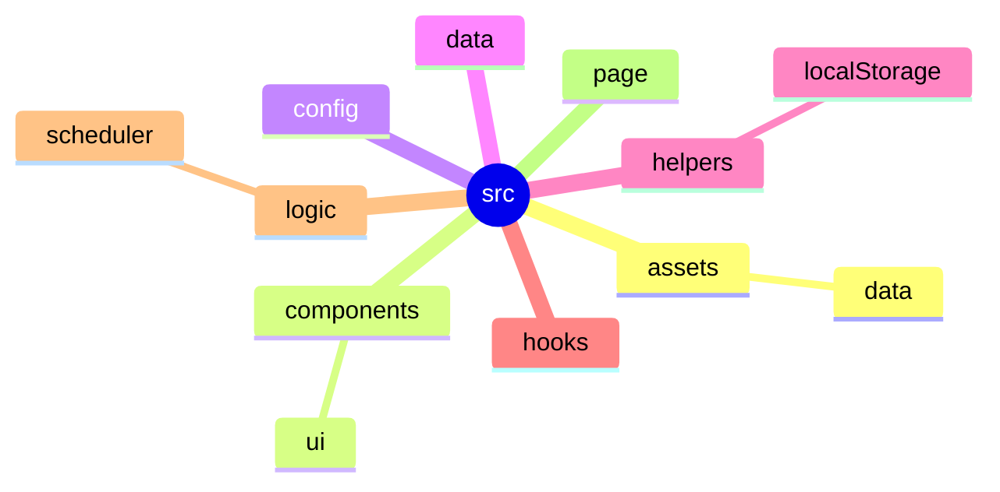

# Kiến trúc Dự án Tổng Quan (hcmus-portal-tool-ver2)

## 1. Cấu trúc thư mục (Directory Structure)
Sơ đồ dưới đây trình bày cấu trúc cây thư mục mã nguồn chính nằm trong `src/` nhằm giúp hình dung rõ sự phân bổ logic của hệ thống.

## 2. Chi tiết Lớp (Class), Hàm (Function) và Giao diện (Interface)

### 📌 Thư mục Cấu hình và Hằng số (`src/config/`)
- **`academic.ts`**: Cấu hình chuyên sâu về nguyên tắc học vụ, điểm sổ (`ACADEMIC_RULES`).
- **`appConfig.ts`**: Thông tin cấu hình chính ứng dụng (`APP_CONFIG`).
- **`GPA.ts`**: Thang xếp loại học lực điểm số (`GPA_CONFIG`).
- **`splitSemester.ts`**: Cấu hình chia giai đoạn Học kỳ (`SPLIT_SEMESTER_CONFIG`).
- **`storageKeys.ts`**: Định dạng khóa cho cất trữ LocalStorage (`STORAGE_KEYS`).
- **`theme.ts`**: Bảng màu trực quan cho Lịch học (`UI_COLORS`).

### 📌 Thư mục Cấu trúc Dữ liệu (`src/data/`)
- **`courseData.ts`**:
  - Giao diện `Course` định nghĩa kiểu dữ liệu môn học.
- **`timetableData.ts`**: 
  - Giao diện `ClassSection`, `RegisteredCourse`.
  - Các hàm tiện ích xếp lịch: `getConfirmedClasses`, `hasConflict`, `getConflictingClasses`.
  - Hằng số: `timePeriods`, `weekDays`, `registeredCourses`.

### 📌 Thư mục Hooks Tuỳ Chỉnh (`src/hooks/`)
Đại diện cho phần Controller kết nối view và logic tĩnh:
- **`useCourseData.ts`**: Hàm chính `useCourseData` và giao diện `CourseGroupState`.
- **`useScheduleSolver.ts`**: Hàm chính `useScheduleSolver` điều khiển thuật toán, kèm các giao diện `ScheduleOption`, `SolverPreferences`.
- **`useStudentGradeData.ts`**: Hàm chính `useStudentGradeData`, giao diện `CourseGrade`.

### 📌 Thư mục Các Công cụ Hỗ trợ và Backend phi trạng thái (`src/logic/`)
Đây là bộ não của ứng dụng chứa luồng xếp lịch TKB:
- **`Utils.ts`**: Hàm `encodeScheduleToMask`, `decodeScheduleMask`, giao diện `ScheduleSlot`.
- Thư mục con `scheduler/`:
  - **`Bitset.ts`**: Lớp xử lý mảng cờ bit `Bitset`.
  - **`Chromosome.ts`**: Lớp quản lý cá thể Nhiễm sắc thể `Chromosome`.
  - **`Constants.ts`**: Hằng số thuật toán `CONFIG`, `WEIGHTS`.
  - **`CourseDatabase.ts`**: Lớp chứa dữ liệu trong thời gian giải quyết `CourseDatabase`.
  - **`FitnessValuator.ts`**: Đánh giá độ tốt lịch; Lớp `FitnessEvaluator` và giao diện `Preferences`, `ClassSession`, `SubjectItem`, v.v.
  - **`GeneticSolver.ts`**: Lớp Thuật toán giải quyết TKB `GeneticSolver`.
  - **`GroupScheduler.ts`**: Hàm xử lý xếp lịch nhóm `runGroupScheduleSolver`.
  - **`Recommender.ts`**: Lớp xử lý luồng logic tư vấn học thuật `PrerequisiteGraph`, `CourseRecommender`.
  - **`Scheduler.ts`**: Hàm gọi đầu vào cho bộ xếp lịch `runScheduleSolver`.

### 📌 Thư mục Thành phần Giao diện & Màn hình (`src/components/` & `src/page/`)
Các thành phần giao diện không trạng thái hoặc có trạng thái nhẹ:
- **`components/`**: Các mảnh ghép dựng sẵn
  - `BookmarkletButton.tsx` (Khối nút kéo thả mã script)
  - `CourseCard.tsx` / `CourseRow.tsx` (Tuỳ hiển thị lưới hay hàng cho Môn Học)
  - `CourseRecommendations.tsx` (Component cho Hệ Tiên Quyết)
  - `GPASimulator.tsx` (Mô phỏng điểm bảng điều khiển)
  - `Header.tsx` (Khối điều hướng chính)
  - `PrerequisiteFlowchart.tsx` (Hiển thị luồng tiên quyết)
  - `SelectionBasket.tsx` (Túi môn học xếp lịch)
- **`page/`**: Các Màn hình hiển thị đầy đủ (Page Views)
  - `DashboardWidgets.tsx` (Trang thống kê chung)
  - `GradeManagement.tsx` (Trang Quản lý điểm chuyên sâu)
  - `IntegratedStudyRoadmap.tsx` (Trang Lộ trình học/TKB khuyên dùng)
  - `Setting.tsx` (Trang Cài đặt hệ thống)
  - `TuitionPage.tsx` (Trang Học phí)
  - `VisualSchedule.tsx` (Trang Lịch học trực quan)

### 📌 Mốc Đầu Vào Ứng Dụng (`src/`)
- Mạch luồng React chạy vào từ **`main.tsx`** và gọi **`App.tsx`** làm root component tổng phân phối Routing và Navigation cho toàn bộ các trang con.
