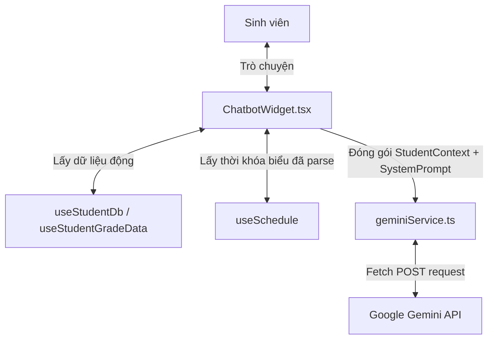

# Tài Liệu Tích Hợp Chatbot Học Thuật Thông Minh UStudy

Tài liệu này hướng dẫn chi tiết về mặt kỹ thuật, kiến trúc dữ liệu, kỹ thuật Prompt Engineering, và các bản vá UI đã được thực hiện để hoàn thiện **Trợ Lý Học Thuật Thông Minh (UStudy Chatbot)** tích hợp trí tuệ nhân tạo Gemini.

---

## 1. Tổng Quan Hệ Thống

Trợ lý UStudy đóng vai trò như một người bạn đồng hành ảo, hỗ trợ sinh viên quản lý tiến trình học tập cá nhân trực quan. Chatbot không chỉ trả lời các câu hỏi thông thường mà còn kết nối sâu sắc với cơ sở dữ liệu thời khóa biểu thực tế, bảng điểm học tập, và lịch thi của từng sinh viên dưới thời gian thực.



---

## 2. Kiến Trúc & Luồng Dữ Liệu Động (RAG)

Để chatbot đưa ra câu trả lời chuẩn xác nhất và cá nhân hóa theo từng tài khoản, hệ thống đóng gói toàn bộ trạng thái học tập của sinh viên thành một `StudentContextData` gửi kèm theo mỗi lượt chat:

### 2.1 Định nghĩa Kiểu dữ liệu ngữ cảnh (`geminiService.ts`)
```typescript
export interface StudentContextData {
    name: string;
    gpa10: number;
    accumulatedCredits: number;
    totalCreditsRequired: number;
    estimatedTuition: number;
    gradesHistory: Array<{
        course_id: string;
        course_name: string;
        credits: number;
        grade: number;
    }>;
    currentSchedule: Array<{
        course_id: string;
        course_name: string;
        class_code: string;
        credits: number;
        type: string;
        instructor: string;
        room: string;
        dayOfWeek: number;
        startPeriod: number;
        endPeriod: number;
        startTime: string;
        endTime: string;
        startDate: string;
        endDate: string;
        totalWeeks: number;
    }>;
    exams?: Array<{
        course_id: string;
        course_name: string;
        exam_type: string;
        exam_date: string;
        exam_time: string;
        room?: string;
        location?: string;
        notes?: string;
    }>;
    currentWeek?: number | null;
    semesterStartDateStr?: string;
}
```

### 2.2 Đồng bộ hóa Lịch học thông qua `useSchedule()`
Trước đây, Chatbot chỉ nhận thông tin đăng ký lớp thô từ `localStorage` vốn thiếu trường dữ liệu ngày kết thúc (`endDate`) và tổng số tuần (`totalWeeks`). Hệ thống đã được nâng cấp để nạp dữ liệu từ các đối tượng `scheduleData.sessions` đã qua xử lý phân tích logic của hệ thống. 

Nhờ đó, mỗi lớp học khi gửi sang Gemini sẽ chứa đầy đủ dòng đời hoạt động:
* **Học từ... đến...**: ví dụ `Học từ 02/03/2026 đến 11/05/2026 (10 tuần)`.
* **Phân định lịch chi tiết**: `Thứ 5, Tiết 1-4 (07:30 - 11:00)`.

---

## 3. Kỹ Thuật Prompt Engineering (System Instruction)

System Prompt trong `geminiService.ts` được thiết kế chặt chẽ nhằm định hướng hành vi của AI theo môi trường học đường chuẩn mực, xử lý logic thời gian và xếp hạng học lực.

### 3.1 Quy tắc Tính Tuần & Giải quyết trùng lịch học nửa kỳ
Khi sinh viên hỏi các câu hỏi dạng *"Thứ 5 tuần 11 học môn gì"*, AI sẽ thực hiện các bước suy luận sau:
1. Xác định mốc thời gian của Tuần X bằng cách lấy `ngày bắt đầu học kỳ` cộng thêm `(X - 1) * 7 ngày`.
2. Đối chiếu ngày cụ thể đó xem có nằm trong khoảng `[startDate, endDate]` học thực tế của từng môn hay không.
3. Giải quyết triệt để vấn đề trùng lịch học nửa học kỳ (ví dụ: Thứ 5 tiết 6-9 phòng F105 có cả môn Triết và môn Lịch sử Đảng trùng lịch):
   * *Môn nửa kỳ trước (CNXHKH)*: Học từ `02/03/2026` đến `20/04/2026`.
   * *Môn nửa kỳ sau (Lịch sử Đảng)*: Học từ `20/04/2026` đến `22/06/2026`.
   * Tại Tuần 11 (ngày 14/05/2026), AI chỉ chọn và hiển thị duy nhất môn đang hoạt động là Lịch sử Đảng.

### 3.2 Quy chuẩn đánh giá GPA Thang điểm 10 (Theo HCMUS)
Trường Đại học Khoa học Tự nhiên xét xếp loại học lực chính thức dựa trên **Thang điểm 10**. Prompt cấu hình bắt buộc AI:
* **Cấm quy đổi điểm**: Không tự ý đổi sang thang điểm 4 (A, B, C, D) hay thang điểm chữ trừ khi được hỏi cụ thể.
* **Xếp loại nghiêm ngặt**:
  * **>= 9.0**: Xuất sắc.
  * **8.0 đến < 9.0**: Giỏi.
  * **7.0 đến < 8.0**: Khá.
  * **5.0 đến < 7.0**: Trung bình.
  * **< 5.0**: Yếu/Kém (Rớt môn).
* *Ví dụ thực tế*: Sinh viên đạt GPA `8.74` sẽ được chatbot đọc chính xác điểm số `8.74` và nhận xét xếp loại **GIỎI**, tuyệt đối không nhầm sang Xuất sắc.

### 3.3 Tính năng "Review Thầy Cô" vui nhộn & Thân thiện
Khi sinh viên hỏi thăm về phong cách giảng dạy hoặc độ khó/dễ chấm điểm của các thầy cô giáo (ví dụ: *"Thầy Nguyễn Văn A chấm điểm có gắt không bạn?"*), Chatbot sẽ chuyển đổi phong cách:
* **Nhập vai sinh viên khóa trước**: Trả lời hài hước, dí dỏm, mách nước các mẹo "sống sót" học đường cực kỳ thực tế nhưng thân thiện.
* **Giữ gìn xưng hô**: Dù vui tươi và trẻ trung nhưng luôn xưng hô chuẩn mực là `bạn` và `mình`, không sử dụng các từ xưng hô suồng sã (như sếp, đại gia, đại ca) để giữ tác phong học đường văn minh.

---

## 4. Các Bản Vá Lỗi Hiển Thị & Giao Diện UI

Để hiển thị thông tin học tập trực quan và gọn gàng, bộ phân tích cú pháp Markdown tự xây dựng (Lightweight Parser) trong `ChatbotWidget.tsx` đã được nâng cấp đáng kể nhằm loại bỏ lỗi hiển thị:

### 4.1 Vá lỗi Danh sách (Bullet List) bị nuốt phần tử
* **Vấn đề cũ**: Regex gộp thẻ `<li>` thành cụm `<ul>` bị lỗi bắt nhóm phụ (`$1`), dẫn đến việc nếu chatbot phản hồi danh sách 5 môn học, giao diện sẽ nuốt sạch 4 môn đầu tiên và chỉ render ra đúng môn học cuối cùng.
* **Giải pháp**: Thay thế biểu thức regex sử dụng biến toàn chuỗi matched `$&`:
  ```typescript
  // Đổi các li liền kề thành ul. Dùng $& để lấy toàn bộ chuỗi được match (tất cả các thẻ li).
  html = html.replace(/(?:<li.*?>.*?<\/li>\n?)+/g, '<ul class="my-2 space-y-1 pl-2">$&</ul>');
  ```

### 4.2 Vá lỗi Trùng lặp nội dung khi render Bảng (Markdown Table)
* **Vấn đề cũ**: Khi phát hiện dòng bắt đầu bằng `|`, hệ thống tích lũy mã HTML của bảng vào `tableHtml` nhưng không dọn dẹp các dòng thô trong mảng `lines`. Khi join lại, các dòng thô Markdown nằm xếp chồng lên bảng HTML hoàn chỉnh làm vỡ giao diện.
* **Giải pháp**: Gán rỗng các dòng thô đã xử lý (`lines[i] = ''`) và thực hiện lọc bỏ phần tử rỗng `.filter(l => l !== '')` trước khi join lại.

### 4.3 Mở rộng Gợi ý câu hỏi nhanh (Quick Actions)
Danh sách các câu hỏi nhanh được mở rộng lên **6 tùy chọn** bố trí dạng lưới grid 2 cột cân đối, bao gồm đầy đủ các kịch bản thực tế của sinh viên:
1. **📅 Lịch học Tuần 11**: Phân tích thời khóa biểu nửa kỳ.
2. **👨‍🏫 Review Thầy Cô**: Trải nghiệm phong cách "review mách nước" thú vị.
3. **📊 Phân tích GPA**: Đánh giá học lực chính xác theo thang điểm 10.
4. **⚠️ Cảnh báo học vụ**: Đối chiếu quy chế cảnh báo của trường HCMUS.
5. **📚 Gợi ý môn học**: Tư vấn môn đăng ký cải thiện GPA hoặc môn học tiếp theo.
6. **💸 Học phí & Học lại**: Ước lượng học phí học kỳ hiện tại và quy tắc cải thiện điểm.

---

## 5. Hướng Dẫn Cấu Hình Hệ Thống

Để chatbot hoạt động ổn định, cần đảm bảo các cấu hình sau:

1. **Khóa API Gemini**: Thiết lập khóa API trong file `.env` tại thư mục gốc của dự án:
   ```env
   VITE_GEMINI_API_KEY=your_gemini_api_key_here
   ```
2. **Phiên bản Model khuyến nghị**: Dự án đang kết nối trực tiếp đến Endpoint của Gemini API:
   * **Gemini 2.5 Flash** hoặc **Gemini 1.5 Flash** (cho tốc độ phản hồi cực nhanh, chi phí tối ưu).
   * **Gemini 1.5 Pro** (cho các tác vụ cần tư vấn học tập và quy chế học thuật chuyên sâu).
