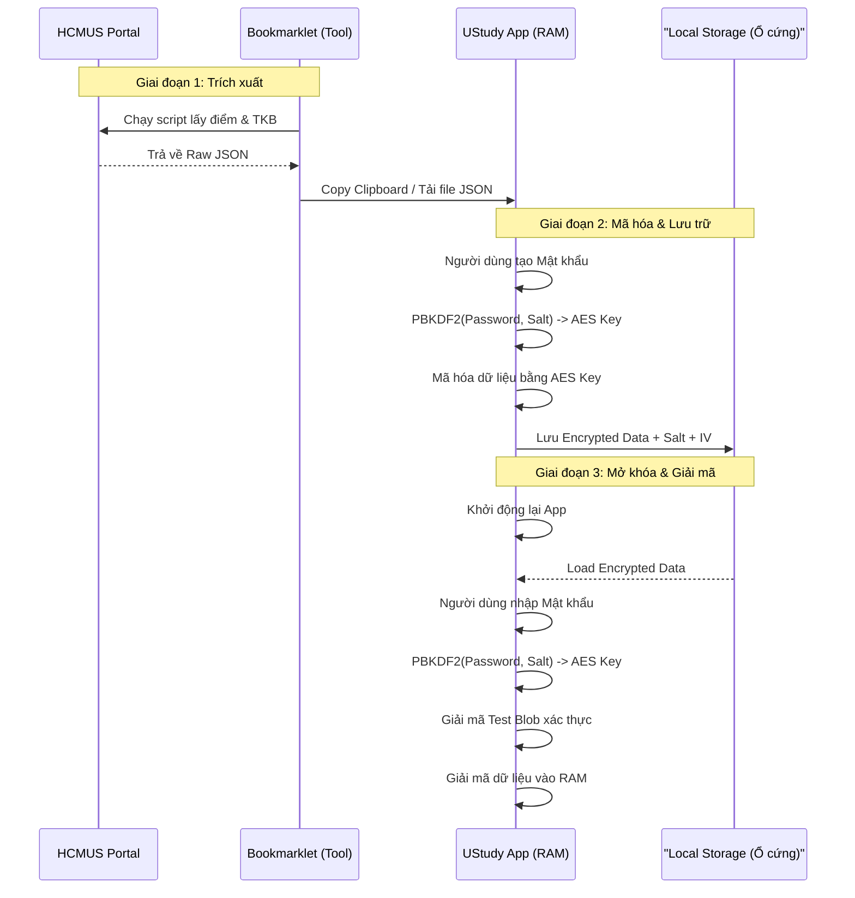
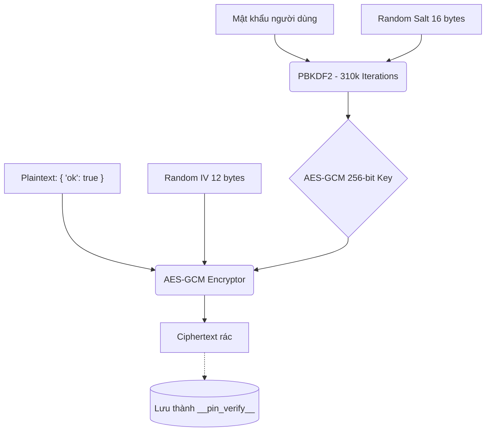

# Kiến trúc Bảo mật Dữ liệu UStudy

Tài liệu này mô tả chi tiết chuyên sâu luồng xử lý và bảo mật dữ liệu của ứng dụng UStudy. Hệ thống được thiết kế theo nguyên tắc **Zero-Knowledge Architecture** — nghĩa là toàn bộ dữ liệu chỉ tồn tại ở dạng có thể đọc được (plaintext) bên trong RAM thiết bị của bạn, và ứng dụng hoàn toàn không lưu trữ mật khẩu của bạn ở bất kỳ đâu.

## 1. Tổng quan Luồng Dữ liệu (End-to-End)

Dữ liệu di chuyển từ hệ thống của trường (HCMUS Portal) qua công cụ trung gian (Bookmarklet) và được khóa chặt tại trình duyệt web của bạn.



## 2. Đi sâu vào Từng Giai đoạn

### Giai đoạn 1: Trích xuất Dữ liệu (Bookmarklet)
- Bookmarklet là một đoạn mã JavaScript thuần. Khi bạn ấn vào nó trên trang Portal đang đăng nhập, nó sẽ quét các thẻ HTML (như `<table>`, `<tr>`, `<td>`) chứa bảng điểm và lịch học.
- Hệ thống gom tất cả dữ liệu thô này thành một file JSON (VD: `{"student": {"name": "Nguyễn Văn A"}, "grades": [...]}`). Quá trình quét và xuất file **chạy 100% trên máy của bạn**, hoàn toàn không gửi dữ liệu qua bất kỳ máy chủ (server) nào.

### Giai đoạn 2: Khởi tạo Bảo mật (Setup)
Khi bạn đưa file JSON này vào UStudy và tạo Mật khẩu (VD: `Hcmus@2024`), quy trình phức tạp sau sẽ diễn ra ngay lập tức:

1. **Sinh Salt (Muối):** 
   Trình duyệt tạo ra một chuỗi 16-byte ngẫu nhiên (VD: `4F a2 b9...`). Salt này được lưu công khai. Tác dụng của nó là đảm bảo dù 2 người dùng đặt cùng một mật khẩu, thì chìa khóa sinh ra vẫn hoàn toàn khác nhau, ngăn chặn tấn công bằng Rainbow Tables.
   
2. **Tạo Chìa khóa (Key Derivation):** 
   Hệ thống không dùng mật khẩu của bạn để mã hóa. Thay vào đó, nó dùng hàm **PBKDF2-HMAC-SHA256**. Hệ thống lấy Mật khẩu (`Hcmus@2024`) trộn với Salt, sau đó **băm (hash) đi băm lại 310.000 lần**. Kết quả cuối cùng là một Khóa mã hóa `CryptoKey` siêu dài (256-bit). Việc phải băm 310.000 lần khiến cho hacker mất cực kỳ nhiều thời gian nếu muốn thử dò từng mật khẩu một (Brute-force).

3. **Tạo Test Blob (Vật chứng xác thực):** 
   Hệ thống tạo ra một chuỗi dữ liệu gốc (Plaintext) cực kỳ đơn giản: 
   ```json
   { "ok": true, "ts": 1715000000000 }
   ```
   Hệ thống lấy `CryptoKey` vừa tạo ở bước 2 để **mã hóa** chuỗi Plaintext này bằng thuật toán **AES-GCM**. Chuỗi sau khi mã hóa (Ciphertext) biến thành một đống ký tự lộn xộn không thể đọc được. Đống lộn xộn này được lưu vào Local Storage với tên là `__pin_verify__`. 
   
   > [!IMPORTANT]
   > UStudy **không lưu mật khẩu** của bạn. UStudy **không lưu mã băm mật khẩu** của bạn. UStudy chỉ lưu cái chuỗi đã mã hóa `__pin_verify__` kia.

4. **Mã hóa Dữ liệu Học tập:** 
   Dữ liệu JSON bảng điểm của bạn cũng được mã hóa bằng AES-GCM với `CryptoKey` tương tự như trên và lưu xuống ổ cứng.



### Giai đoạn 3: Xác thực và Giải mã (Unlock)
Hôm sau, bạn mở trình duyệt lên và UStudy yêu cầu nhập mật khẩu. Đây là cách nó kiểm tra xem mật khẩu bạn nhập có đúng không:

1. Hệ thống đọc `Salt` từ ổ cứng.
2. Bạn nhập mật khẩu. Hệ thống mang Mật khẩu + `Salt` cho chạy qua 310.000 vòng PBKDF2 để tạo ra một `CryptoKey` tạm.
3. Hệ thống lôi cục Ciphertext `__pin_verify__` từ ổ cứng lên, và dùng `CryptoKey` tạm để thử **Giải mã**.
   - **Trường hợp 1 (Nhập sai):** Nếu bạn nhập sai mật khẩu, `CryptoKey` tạm sinh ra sẽ bị sai. Thuật toán AES-GCM khi cố gắng giải mã sẽ phát hiện ngay lập tức (nhờ Authentication Tag bị lệch) và báo lỗi thất bại. UStudy biết ngay là bạn nhập sai.
   - **Trường hợp 2 (Nhập đúng):** Hệ thống giải mã thành công cục Ciphertext, và đọc được dòng Plaintext là `{ "ok": true, "ts": ... }`. Ngay khi đọc được chữ `"ok": true`, hệ thống biết 100% mật khẩu của bạn là chính xác!
4. Sau khi xác nhận mật khẩu đúng, hệ thống dùng chính `CryptoKey` đó để giải mã toàn bộ dữ liệu bảng điểm, đưa nó vào RAM (bộ nhớ tạm) để hiển thị lên màn hình.

> [!TIP]
> Cơ chế dùng `__pin_verify__` với Plaintext `{ "ok": true }` chính là bí quyết giúp UStudy biết mật khẩu của bạn là đúng hay sai mà không bao giờ phải lưu trữ nó. Nếu một Hacker trộm được toàn bộ Local Storage của bạn, họ không thể "dịch ngược" cái `__pin_verify__` để tìm ra Key, vì thuật toán AES là mã hóa một chiều bất khả nghịch.

## 3. Các Cơ chế Bảo vệ Bổ sung

* **Chống dò mã (Brute-force Lockout):** Dù hacker không thể dịch ngược, nhưng họ có thể dùng tool tự động nhập mật khẩu hàng ngàn lần. UStudy ngăn chặn điều này bằng cách đếm số lần nhập sai. Sai 5 lần -> khóa 30 giây. Sai tiếp -> khóa 60 giây, 5 phút...
* **RAM-only Key:** Chìa khóa `CryptoKey` thực sự chỉ nằm trong RAM. Khi bạn đóng Tab trình duyệt, RAM bị xóa. Chìa khóa biến mất không dấu vết.
* **Self-Destruct (Cơ chế Tự hủy):** Khi bạn ấn "Quên Mật khẩu", hệ thống sẽ xóa toàn bộ Local Storage. File mã hóa mất, `Salt` mất. Dữ liệu của bạn biến mất vĩnh viễn khỏi máy tính, bảo vệ quyền riêng tư tuyệt đối.
